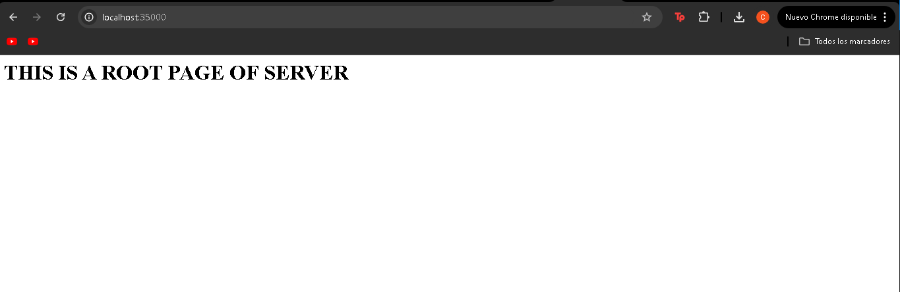
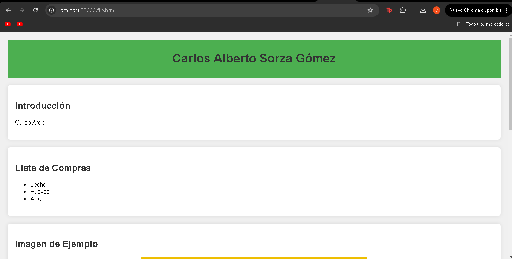
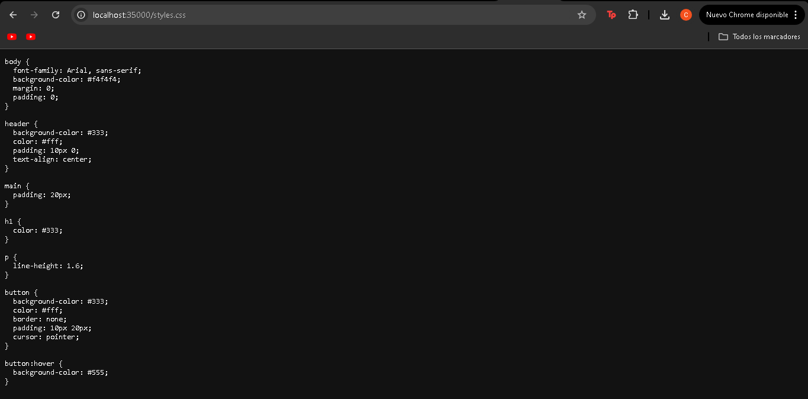
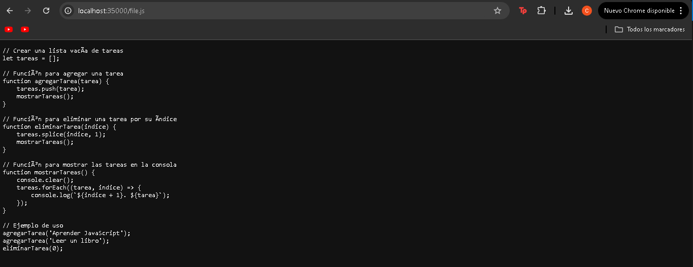
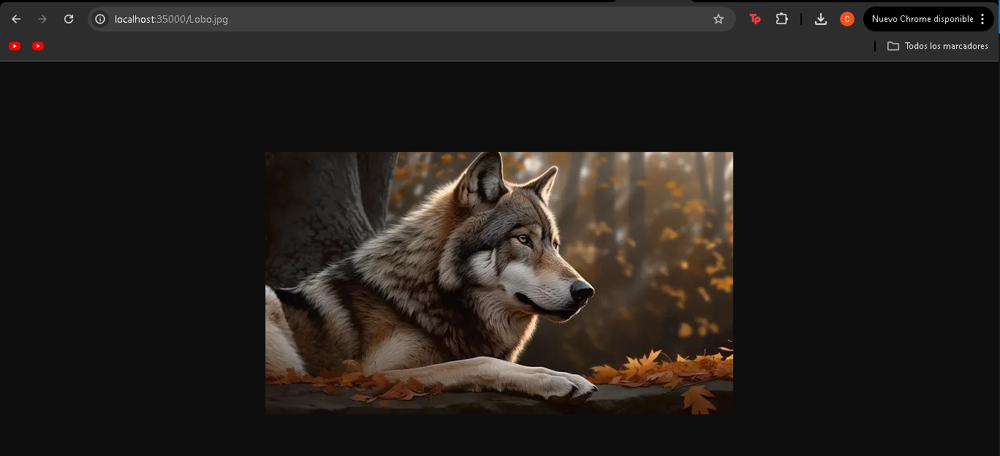
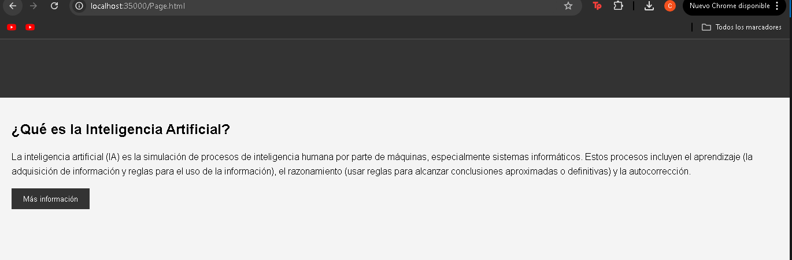
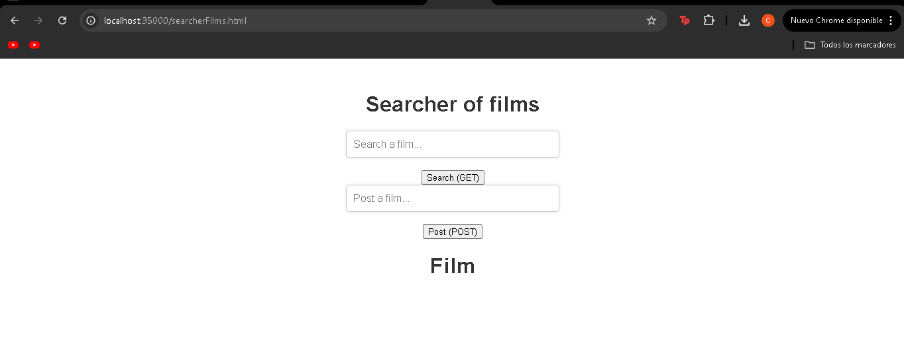
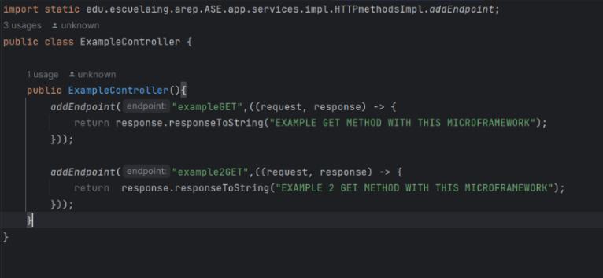
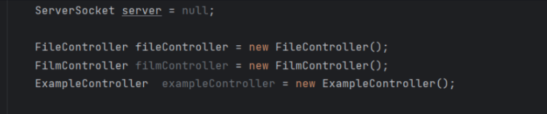

# Laboratorio 2: TALLER MICROFRAMEWORKS-WEB-AREP


Programa diseñado para emular el microframework Spark mediante el uso de funciones lambda.


### Prerequisitos

Para desarrollar este proyecto se necesitaron:

- Maven: Apache Maven es una herramienta que gestiona el ciclo de vida del proyecto.

- Git: Es un sistema de control de versiones distribuido (VCS).

- Java 19: Java es un lenguaje de programación orientado a objetos, de propósito general, portátil y muy versátil.


### Instalación del taller

Clonamos el repositorio

```
    https://github.com/CarlosSorza/MICROFRAMEWORKS-WEB-AREP.git

```
Se accede a la carpeta principal del repositorio que acabamos de clonar.

	 cd MICROFRAMEWORKS-WEB-AREP

Hacemos la ejecución y empaquetamiento del proyecto

	 mvn package
---
### Empaquetar e install
Corremos los siguientes comando
	
	 mvn clean package install
	 mvn clean install

Ahora corremos el servidor
	
Ahora entramos al nuestro navegador con la URL

	 http://localhost:35000/

Aquí debería cargarse la siguiente página, desde la cual podemos comenzar a realizar las distintas búsquedas. 




# Documentos HTML




# Documentos CSS




# Documentos JS





# Documentos JPG





# Documentos aplicacion HTML CSS Y JS





# Aplicacion de servicio REST





# ¿Cómo podría el desarrollador construir una aplicación utilizando este marco de trabajo?

Es sencillo: primero, debe crear un controlador para añadir los endpoints a la estructura de datos que se encargará de buscar el método correspondiente. Luego, debe implementar las funciones lambda para gestionar las solicitudes. En este caso, hemos creado dicho controlador. 





 y luego debemos instanciar el controlador dentro del servidor web.





---
### Ejecutando test

Ejecutamos el comando

	mvn test
	
---


### Arquitectura del programa

El programa se organiza en varias capas, cada una con una función específica:

## HTTPserver

La capa HTTPserver sirve como punto de entrada para las solicitudes entrantes, dirigiéndolas a las secciones adecuadas del programa.

## Controllers

La capa Controllers recibe las solicitudes del servidor y las redirige a los servicios correspondientes, actuando como un intermediario entre el servidor y la lógica de negocio.

## Services

La capa Services alberga la lógica de negocio y se encarga de ejecutar las operaciones requeridas por las solicitudes del usuario.

## ExternalWebServices

La capa ExternalWebServices se encarga de interactuar con servicios web externos, permitiendo a la aplicación acceder a recursos y funcionalidades más allá de su alcance inmediato.

## Static

La capa Static almacena archivos estáticos como HTML, JS, CSS e imágenes. Estos archivos se sirven a los usuarios para presentar la interfaz de usuario en sus navegadores.

Esta estructura de capas facilita la organización, mantenimiento y escalabilidad del programa al dividir las responsabilidades en componentes claros y definidos.


## Autor

Carlos Alberto Sorza Gómez